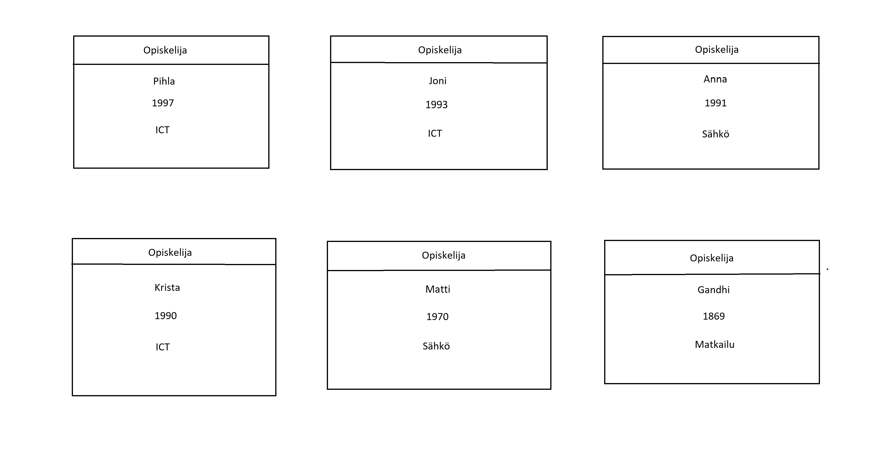

# SQL
## Tehtävä 1
Vastaus: Omalla nimellä löytyi vain 3 hakutulosta mutta nimillä Matti ja Maija löytyi todella paljon hakutuloksia.
## Tehtävä 2 
Vastaus: En osaa edes sanoa kuinka moneen palveluun olen laittanut sähköpostin koska niitä on niin paljon. Oman nimen ja syntymäpäivän olen laittanut erilaisiin sosiaalisen median palveluihin.
## Tehtävä 3
Vastaus: 
## Tehtävä 4
Vastaus: SELECT * FROM kurssisuoritus
## Tehtävä 5
Vastaus: SELECT kurssi FROM kurssisuoritus
## Tehtävä 6
Vastaus: SELECT DISTINCT kurssi FROM kurssisuoritus
## Tehtävä 7
Vastaus: SELECT * FROM Opiskelija WHERE nimi = 'Anna'
## Tehtävä 8
Vastaus: SELECT * FROM kurssisuoritus WHERE opiskelija = '999999'
## Tehtävä 9
Vastaus: SELECT DISTINCT pääaine FROM Opiskelija WHERE pääaine LIKE '%tiede%'. Jos laittaa "LIKE" tilalle "NOT LIKE" siellä näkyy vain ne jossa ei ole sanaa tiede.
## Tehtävä 10
Vastaus: SELECT Kurssi.nimi, Kurssisuoritus.päivämäärä, Kurssisuoritus.arvosana FROM Kurssi, Kurssisuoritus WHERE Kurssi.kurssitunnus = Kurssisuoritus.kurssi
## Tehtävä 11
Vastaus: SELECT Opiskelija.nimi, Kurssisuoritus.päivämäärä, Kurssisuoritus.arvosana FROM Opiskelija, Kurssisuoritus WHERE Opiskelija.opiskelijanumero = Kurssisuoritus.opiskelija
## Tehtävä 12
Vastaus: SELECT Kurssi.nimi AS kurssi, Tehtävä.nimi AS tehtävä FROM Kurssi, Tehtävä, Kurssitehtävä WHERE Kurssi.kurssitunnus = Kurssitehtävä.kurssi AND Tehtävä.tunnus = Kurssitehtävä.tehtävä
## Tehtävä 13
Vastaus: SELECT Kurssi.nimi AS kurssi, Tehtävä.nimi AS tehtävä FROM Kurssi, Tehtävä, Kurssitehtävä, Tehtäväsuoritus, Opiskelija WHERE Opiskelija.nimi = 'Anna' AND Kurssi.kurssitunnus = Kurssitehtävä.kurssi AND Tehtävä.tunnus = Kurssitehtävä.tehtävä AND Kurssitehtävä.tunnus = Tehtäväsuoritus.tehtävä AND Opiskelija.opiskelijanumero = Tehtäväsuoritus.opiskelija
## Tehtävä 14
Vastaus: Toinen kysely kysyy oppilaitten nimiä joten sen takia siinä on 5 riviä.
## Tehtävä 15
Vastaus: SELECT * FROM Kurssi k LEFT JOIN Kurssitehtävä t ON k.kurssitunnus = t.kurssi WHERE t.kurssi IS null
## Tehtävä 16
Vastaus: SELECT kurssi AS kurssikoodi, COUNT(*) AS lukumäärä FROM Kurssisuoritus GROUP BY kurssi
## Tehtävä 17
Vastaus: SELECT k.nimi AS kurssi, COUNT(*) AS lukumäärä FROM Kurssisuoritus ks, Kurssi k WHERE k.kurssitunnus = ks.kurssi GROUP BY k.nimi
## Tehtävä 18
Vastaus: SELECT k.nimi AS kurssi, COUNT(ks.kurssi) as lukumäärä FROM Kurssi k LEFT JOIN Kurssisuoritus ks ON k.kurssitunnus = ks.kurssi GROUP BY k.nimi
## Tehtävä 19
Vastaus: 
