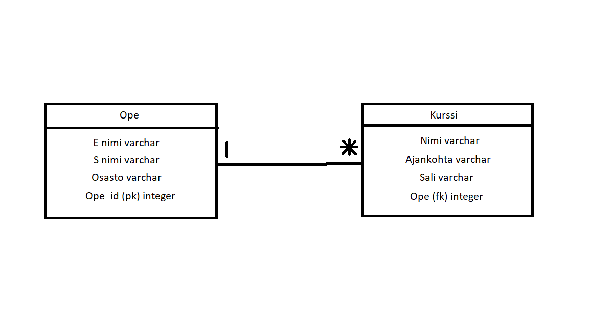

# SQL
## Tehtävä 1
Vastaus: Omalla nimellä löytyi vain 3 hakutulosta mutta nimillä Matti ja Maija löytyi todella paljon hakutuloksia.
## Tehtävä 2 
Vastaus: En osaa edes sanoa kuinka moneen palveluun olen laittanut sähköpostin koska niitä on niin paljon. Oman nimen ja syntymäpäivän olen laittanut erilaisiin sosiaalisen median palveluihin.
## Tehtävä 3
Vastaus: 
## Tehtävä 4
Vastaus: SELECT * FROM kurssisuoritus
## Tehtävä 5
Vastaus: SELECT kurssi FROM kurssisuoritus
## Tehtävä 6
Vastaus: SELECT DISTINCT kurssi FROM kurssisuoritus
## Tehtävä 7
Vastaus: SELECT * FROM Opiskelija WHERE nimi = 'Anna'
## Tehtävä 8
Vastaus: SELECT * FROM kurssisuoritus WHERE opiskelija = '999999'
## Tehtävä 9
Vastaus: SELECT DISTINCT pääaine FROM Opiskelija WHERE pääaine LIKE '%tiede%'. Jos laittaa "LIKE" tilalle "NOT LIKE" siellä näkyy vain ne jossa ei ole sanaa tiede.
## Tehtävä 10
Vastaus: 
